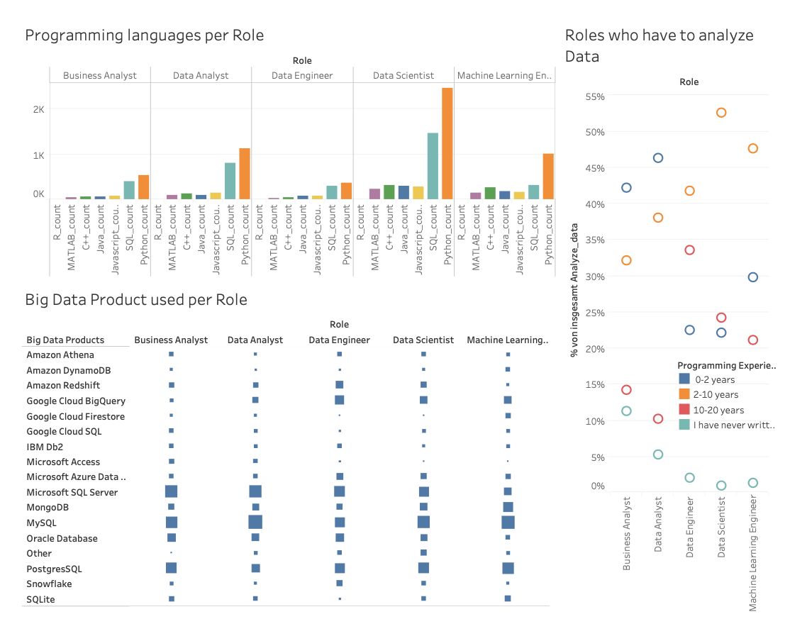

# Data Job Recommender

A role recommender system that suggests which data job fits a person best – based on their current skills, tools and experience.

Final project of the **Data Analyst program at Université Paris 1 Panthéon-Sorbonne (2023)**, built individually by Janine Sukowski.



## The question

People moving into data often don't know which role matches their profile: *Data Analyst, Data Scientist, Data Engineer, Machine Learning Engineer or Business Analyst?*
This project answers that with a classification model trained on real survey data and makes it usable through a small web app.

## Data

- **Source:** [Kaggle Machine Learning & Data Science Survey 2020](https://www.kaggle.com/c/kaggle-survey-2020) (`kaggle_survey_2020_responses.csv`)
- Respondents' answers on programming languages, tools, ML methods, education and experience
- Filtered to the five target roles listed above

## Approach

**1. Preprocessing** (`recommender.py`)
- Removed duplicates, irrelevant questions and columns
- Separated question texts from responses and renamed columns
- Converted multiple-choice answers into binary features, mapped experience levels to numeric values, imputed missing values

**2. Feature engineering**
- One-hot encoding of categorical answers
- Binary features for Kafka, Spark and Hadoop were added **synthetically** for a share of Data Engineer respondents (26 %, 50 %, 42 %) – see *Limitations*

**3. Modelling**
- 80/20 train-test split
- **ADASYN** oversampling to handle class imbalance between roles
- **Linear Discriminant Analysis (LDA)** for dimensionality reduction
- **Support Vector Classifier** (RBF kernel, C = 10, γ = 0.1) with probability estimates
- Exploration and evaluation in `finalCodeDataJob.ipynb`

**4. Web app** (`start.py`, Streamlit)
- *Submit your skills:* users answer the survey questions and get a recommended role
- A role is only recommended if the model is at least **60 % confident** – otherwise the app suggests building more skills first
- *Data Jobs Analysis:* overview dashboard of the survey data

## Run it locally

```bash
git clone https://github.com/GirlsWhoCode0101/data-job-recommender.git
cd data-job-recommender
pip install -r requirements.txt
streamlit run start.py
```

## Tech stack

Python · pandas · NumPy · scikit-learn · imbalanced-learn · Streamlit · Jupyter

## Limitations & next steps

- The synthetic big-data features are an assumption, not survey data – they influence how well Data Engineers are recognised.
- The model is retrained on every app start; caching (`st.cache_resource`) would make the app faster.
- Survey data from 2020 – tools and role profiles have changed since then.
- Next steps: compare with other models (e.g. Random Forest, Logistic Regression), add explainability (which skills drive the recommendation).

## License

GPL-3.0
